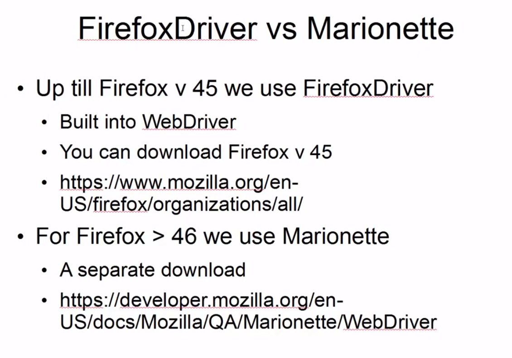
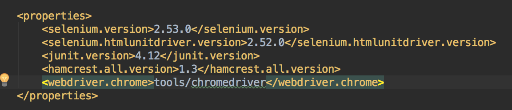

# Selenium Udemy

This is me messing around with Selenium.

### Useful info:

1) HtmlUnitDriver used to be in main Selenium dependency but has since been split. Hence why I've had to add it as a dependency in my pom.xml.

2) If using Firefox Version 45 or below, I can use FirefoxDriver(). However, if I am testing on Firefox Version 46 or above, I need to use another driver entitled 'Marionette'

### Chromedriver and other drivers

If not specified, when I try to run tests that require ChromeDriver, (something) will look to my PATH for chromedriver.

When I use e.g. homebrew to install chromedriver, I don't have to specify (within my test repo) where chromedriver is stored - brew has handled that for me already. Yay.

But if I'm not using brew, I can specify where chromedriver is within my actual tests, for example:

In this instance, despite me using brew on my laptop, I have used the maven surefire plugin and am setting a system property in my pom.xml file:

And the advantage of this is that I don't have to keep specifying chromedriver at the beginning of every individual test.